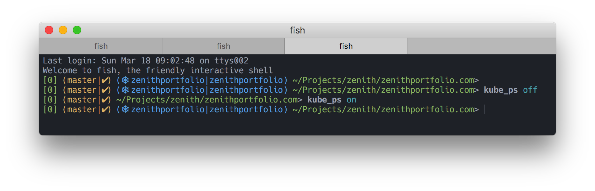

# fish-kube-prompt

⎈ kubectl context/namespace in your fish shell prompt



## Install

```fish
mkdir -p ~/.config/fish/functions/
cd ~/.config/fish/
git clone https://github.com/aluxian/fish-kube-prompt
ln -s ../fish-kube-prompt/__kube_prompt.fish functions/
ln -s ../fish-kube-prompt/kube_ps.fish functions/
```

Then create or edit `~/.config/fish/functions/fish_prompt.fish` to include
kube prompt:

```fish
function fish_prompt
  echo -s (set_color blue) (__kube_prompt) (set_color $fish_color_cwd) " " (prompt_pwd) (set_color normal) "> "
end
```

## Speed

Running the `kubectl` commands to get the context and namespace every time
the prompt is shown would slow down the prompt significantly. Therefore,
`fish-kube-prompt` caches the context and namespace by only calling `kubectl`
when the env var `KUBECONFIG` has changed since the last cache update, or
when the 'last modified' timestamp of the files in `KUBECONFIG` is newer
than the timestamp of the last cache update.

This was not my idea, I took it from `jonmosco/kube-ps1`.

## Config

You can toggle the prompt on or off like this:

```fish
kube_ps on
kube_ps off
```

`kube_ps` is a simple function that just updates a global variable
`__kube_ps_enabled`.

> Many choices have been hard-coded (e.g. colors, delimiters). If there's anything
you'd like to customize, please add an env var and send a PR.

## Credits

Inspired from the awesome work of:

* https://github.com/jonmosco/kube-ps1
* https://github.com/Ladicle/fish-kubectl-prompt

## Author

Alexandru Rosianu (https://github.com/aluxian/dotfiles-fish)

## License

MIT
